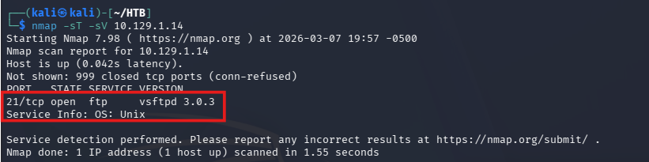
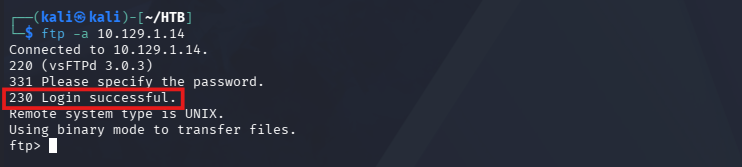
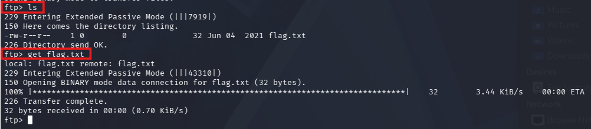
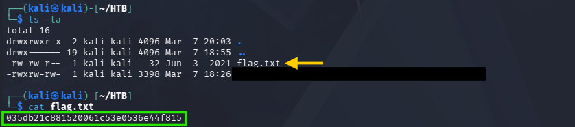

# Hack The Box - Fawn

## Machine Information

| Field | Value |
|------|------|
| Machine | Fawn |
| Difficulty | Very Easy |
| Platform | Hack The Box |
| Target OS | Linux |

---

## Overview

Fawn is a beginner Linux machine focused on the File Transfer Protocol (FTP).  
The objective is to identify an exposed FTP service that allows anonymous login and retrieve the flag from the server.

---

## Initial Enumeration

The first step was to scan the target system for open ports and running services.

```bash
nmap -sT -sV <target_ip>
```

The scan revealed the following:

| Port | Service |
|-----|-----|
| 21/tcp | FTP (vsftpd 3.0.3) |

FTP is a protocol used for transferring files between systems. If anonymous login is enabled, users can access the server without authentication.



---

## Service Interaction

After identifying the FTP service, I connected to the target using the FTP client with anonymous login enabled.

```bash
ftp -a <target_ip>
```

The connection was successful and granted access to the FTP server.



---

## FTP Commands

After connecting to the server, I listed the files available on the FTP system.

```bash
ls
```

The directory listing revealed a flag file available for download.



---

## Retrieving the Flag

The flag file was downloaded from the FTP server.

```bash
get flag.txt
```

After downloading the file, the contents were displayed locally.

```bash
cat flag.txt
```



---

## Task Answers

| Task | Answer |
|-----|-----|
| What does the 3-letter acronym FTP stand for? | File Transfer Protocol |
| Which port does the FTP service listen on usually? | 21 |
| Secure protocol extension of SSH for file transfers | SFTP |
| Command used to send an ICMP echo request | ping |
| FTP version running on the target | vsftpd 3.0.3 |
| OS type running on the target | Unix |
| FTP help command | ftp -? |
| Username used for anonymous login | anonymous |
| FTP response code for "Login successful" | 230 |
| Linux command used to list files | ls |
| Command used to download a file | get |

---

## Skills Demonstrated

- Network enumeration
- Port scanning with Nmap
- FTP service identification
- Anonymous FTP access
- File retrieval from remote services