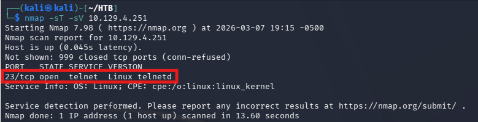
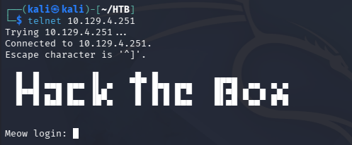
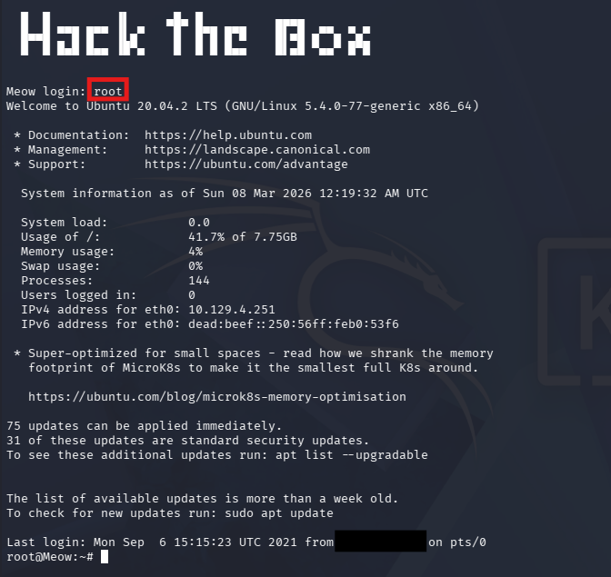
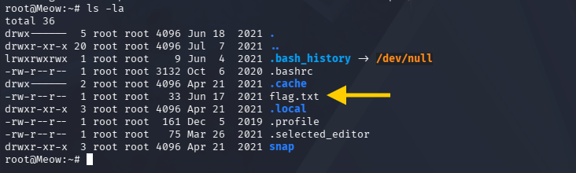
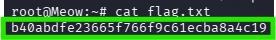

# Hack The Box - Meow Writeup

## Machine Information

| Field | Value |
|------|------|
| Machine | Meow |
| Difficulty | Very Easy |
| Platform | Hack The Box |
| Target OS | Linux |

## Overview

Meow is a beginner Linux machine designed to introduce basic enumeration and remote access techniques.  
The objective is to identify exposed services, access the system through Telnet using default credentials, and retrieve the root flag.

---

## Initial Enumeration

The first step was to scan the target system for open ports and running services.

```bash
nmap -sC -sV <target_ip>
```

The scan revealed the following:

| Port | Service |
|-----|-----|
| 23/tcp | Telnet |

Telnet provides remote command line access to a system. Since it does not encrypt traffic and may allow weak authentication, it is commonly targeted during assessments.



---

## Telnet Access

After identifying the Telnet service, I connected to the target system.

```bash
telnet <target_ip>
```



The login prompt accepted the username:

```
root
```

The password field was left blank, which granted direct shell access.



---

## System Access

After authentication, the session opened with **root privileges**, meaning no privilege escalation was required.

---

## File Enumeration

To view files in the current directory, the following command was used:

```bash
ls -la
```

This displayed the available files on the system, including `flag.txt`.



---

## Retrieving the Flag

The root flag was obtained by reading the flag file.

```bash
cat flag.txt
```



---

## Task Answers

| Task | Answer |
|-----|-----|
| VM acronym | Virtual Machine |
| Command line interaction tool | Terminal |
| VPN service used for HTB labs | OpenVPN |
| Tool for ICMP echo request | ping |
| Port scanning tool | nmap |
| Service running on port 23 | Telnet |
| Username with blank password | root |

---

## Skills Demonstrated

- Basic network enumeration
- Port scanning with Nmap
- Service identification
- Remote access via Telnet
- Basic Linux command usage