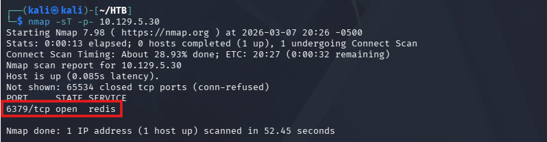
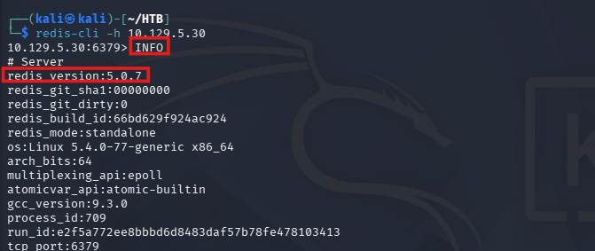
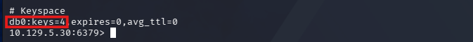
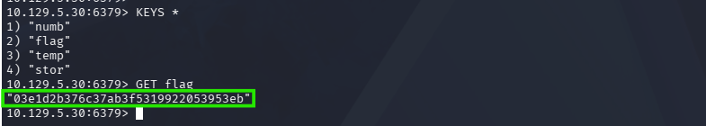

# Hack The Box - Redeemer

## Machine Information

| Field | Value |
|------|------|
| Machine | Redeemer |
| Difficulty | Very Easy |
| Platform | Hack The Box |
| Target OS | Linux |

---

## Overview

Redeemer is a very easy Linux machine that focuses on enumerating and interacting with an exposed Redis database service. The machine demonstrates basic Redis enumeration with `redis-cli` and direct key retrieval to obtain the flag.

---

## Initial Enumeration

```bash
nmap -sT -p- <TARGET_IP>
```

Port | Service
---|---
6379 | redis



---

## Service Interaction

```bash
redis-cli -h <TARGET_IP>
INFO
```

The `INFO` command returned Redis server information, including the version.

```text
redis_version:5.0.7
```



---

## System Access

```bash
SELECT 0
DBSIZE
KEYS *
```

Database `0` contained `4` keys.



---

## File Enumeration

```bash
KEYS *
```

The key list revealed the `flag` key.

---

## Retrieving the Flag

```bash
GET flag
```

The command returned the flag stored in the Redis database.



---

## Task Answers

| Task | Answer |
|------|------|
| Which TCP port is open on the machine? | 6379 |
| Which service is running on the port that is open on the machine? | redis |
| What type of database is Redis? Choose from the following options: (i) In-memory Database, (ii) Traditional Database | In-memory Database |
| Which command-line utility is used to interact with the Redis server? Enter the program name you would enter into the terminal without any arguments. | redis-cli |
| Which flag is used with the Redis command-line utility to specify the hostname? | -h |
| Once connected to a Redis server, which command is used to obtain the information and statistics about the Redis server? | INFO |
| What is the version of the Redis server being used on the target machine? | 5.0.7 |
| Which command is used to select the desired database in Redis? | SELECT |
| How many keys are present inside the database with index 0? | 4 |
| Which command is used to obtain all the keys in a database? | KEYS * |

## Skills Demonstrated

- Service enumeration with Nmap
- Redis interaction with `redis-cli`
- Redis database selection
- Key enumeration and flag retrieval